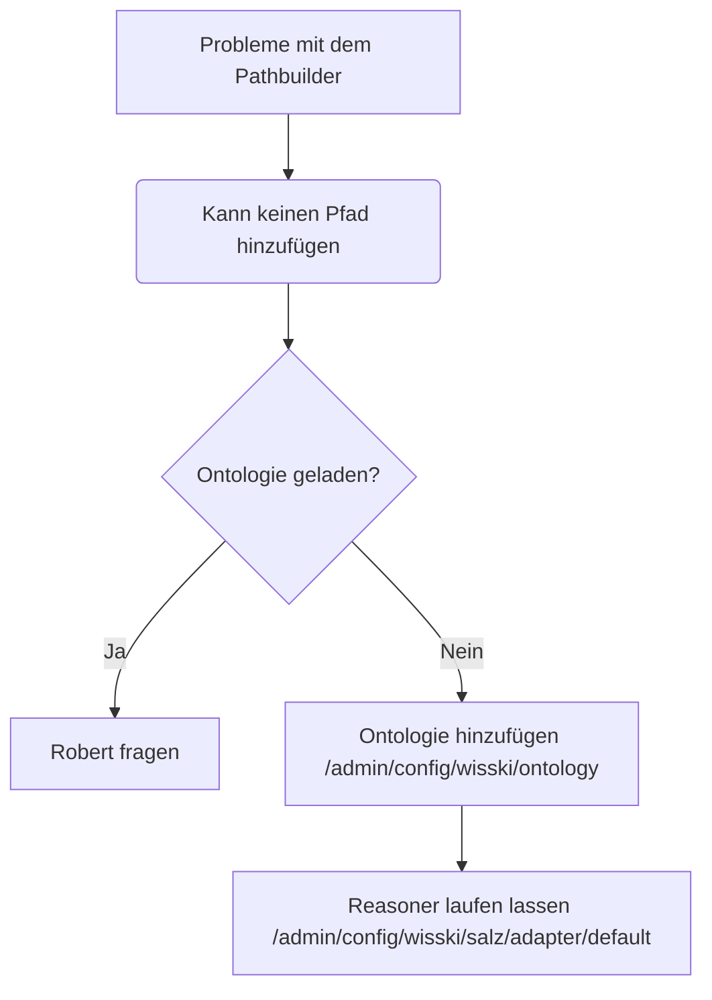

[Hilfe zur Zeichnung](https://mermaid.js.org/syntax/flowchart.html)

```mermaid
flowchart TD
A[Probleme mit dem Pathbuilder] -->B(Kann keinen Pfad hinzufügen)
    B --> C{Ontologie geladen?}
    C -->|Ja| D[Robert fragen]
    C -->|Nein| E[Ontologie hinzufügen /admin/config/wisski/ontology]
    E --> F[Reasoner laufen lassen /admin/config/wisski/salz/adapter/default ]
```
